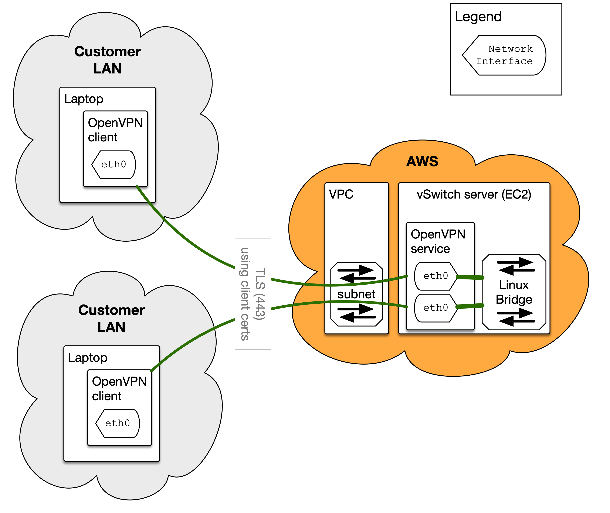
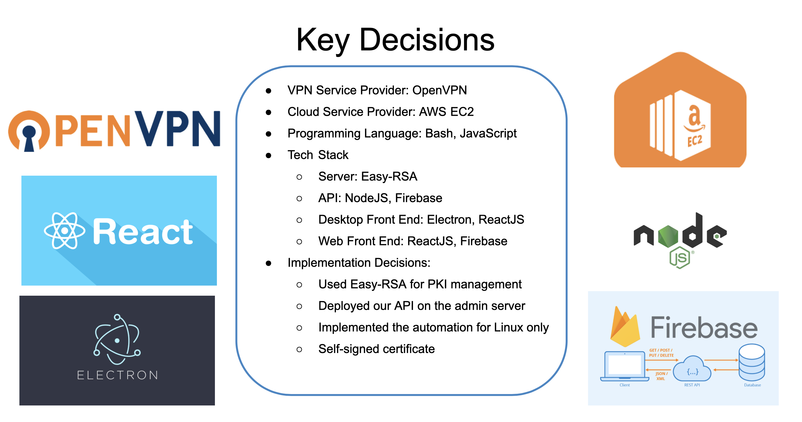

# Cloud vSwitch

## 1. Vision and Goals Of The Project
Cloud vSwitch is a secure and streamlined IT independent VPN as a service in the cloud. Cloud vSwitch provides a VPN connection from each laptop to a central Linux server, and all the VPN connections are connected to a Linux bridge. When the interfaces on each laptop are configured, the laptops can talk to each other. 

High-Level Goals of Cloud vSwitch includes: 
* Allows workers to connect to each other via the cloud in a way that all appear to be on a virtual switch in a local network.
* Provide secure connection, which is TLS for encryption. Access is controlled by a client certificate used on each laptop to initiate the VPN connection to the server. 

## 2. Users/Personas Of The Project
Cloud vSwitch will be used by the end-users of any interested users that want to connect to each other via the cloud in a way that all appear to be on a virtual switch in a local network.

It does not target:
Users that do not have some basic degree of knowledge using cloud
Users that do not need to connect to each other via cloud

## 3. Scope and Features Of The Project
* VPN configuration (OpenStack)/connection/disconnection
* TLS/SSL encryption
* Access control (client certificate)
* Linux bridge setup

## 4. Solution Concept
Global Architectural Structure Of the Project:

A Walkthrough Explanation of the Architectural Structure:
* The vSwitch portal provides an interface for users to do user/organization/instance management
* The vSwitch server sets up and configures virtual network, and makes all the VPN connections connected to a Linux bridge
* TLS/SSL encryption along with the access control by using client certificate provides secure connections

Design Implications and Discussion:
* Since this must be a secure connection, we use TLS for encryption. Also, access is controlled by a client certificate used on each laptop to initiate the VPN connection to the server. This means that the VPN server will act as a certificate authority.
* Cloud platforms that were discussed: AWS

## 5. Acceptance criteria
Minimum acceptance criteria:

A service that allows users to connect to a virtual local area network (LAN) on the AWS via OpenVPN service and a virtual switch server in the network. 
End user devices should be able to talk to each other as if they are on the same local network. Also, the VPN connection should be secured with TLS encryption and access is controlled by a client certificate used on each device to initiate the connection to the server.

Stretch goals:

Build cross-platform desktop applications that work on Windows/MacOS/Linux.
Extend deployment to other cloud computing platforms.
Add advanced user role/resource/organization management.

## 6. Release Planning
### Release #1 
vSwitch server:
As a user, I can instantiate a vSwitch server on the cloud for my organization, so that I can connect to it and work with my coworkers on the same virtual network. I can also terminate this server, so that I can save cloud resources when I do not need the server anymore. 

### Release #2 
VPN connection: 
As a user, I can make a VPN connection to the virtual network in my organization, so that I can work remotely as if I am on the physical local network in my organization. I can also disconnect after I have finished my work, so that my computer network is reset to its previous state.
Virtual LAN:
As a user, I can work with other connected users as if we are on the same local network, so that our connected devices such as desktops can talk to each other directly.

### Release #3
Testing, bug fixes, documentation and UI improvement. 

### Release #4 (Optional)
Feature extension based on the stretch goals.

## 7. Actual Architecture
Our actual architecture is close to what the proposed one was. Server creates a Certificate Authority to issue certificates. The OpenVPN server needs a certificate issued by the CA to identify itself against the clients. Server and client can validate the other side by trusting the CA certificate. After generating the certificate request, the server sends the request to the CA and the CA signs the request to issue a valid certificate. All these certificates and files are then used to configure the OpenVPN server. For the server configuration, we added the CA cert to validate the client certificates, added the server cert and server key to encrypt traffic and authenticate itself against clients. We also used Diffie Hellman to provide Perfect Forward Secrecy, and added the TLS authentication to harden the overall security of OpenVPN. As OpenVPN is using TLS, it makes sense to add HMAC to validate integrity of the packages received.

On the client side, the client gets the CA cert from the server and generates a certificate request. After sending the request to the server, the client gets a signed certificate. With the certificates, client private key, and the TLS-Authentication, we can configure the client.

## 8. Actual Design Decisions

## 9. Actual Sprints

